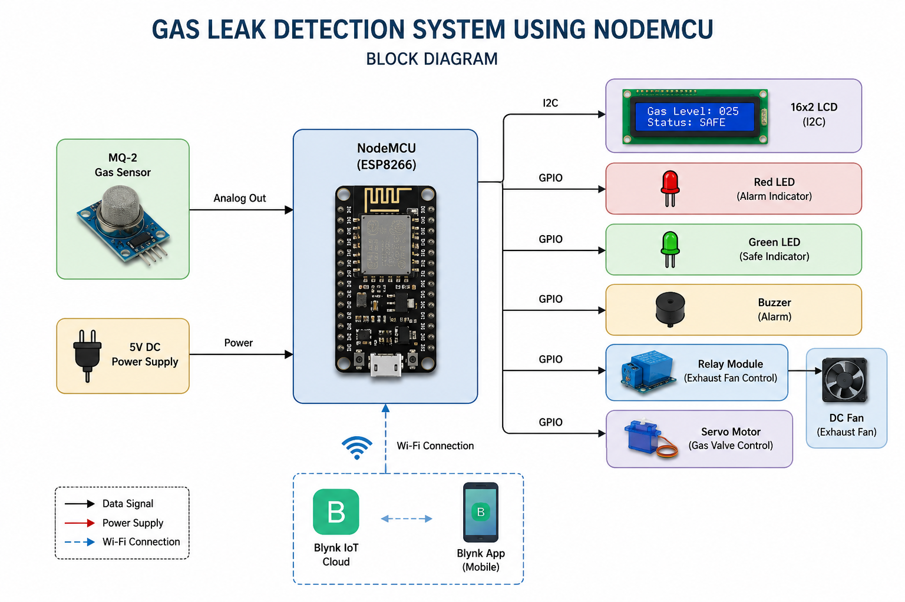
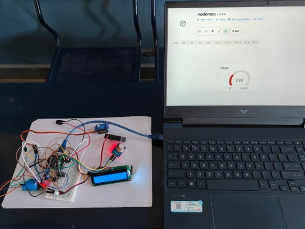

# 🚨 Gas Leak Detection Using NodeMCU


An **IoT-based Gas Leak Detection System** developed using **NodeMCU (ESP8266)** and an **MQ-2 Gas Sensor**. The system continuously monitors gas concentration and automatically alerts users while activating safety mechanisms such as a **buzzer, relay-controlled exhaust fan, LCD display, and servo-controlled gas valve**. Real-time monitoring is enabled through the **Blynk IoT platform**.

---

# 📷 Project Images

## 🔌 Block Diagram

<p align="center">
  
</p>

---

## 🛠 Working Model

<p align="center">
  
</p>

---

# ✨ Features

- 🔍 Real-time gas leak monitoring
- 🌐 Wi-Fi connectivity using NodeMCU ESP8266
- 📱 Blynk IoT mobile notifications
- 📟 16×2 I2C LCD display
- 🚨 Automatic buzzer alarm
- 💨 Relay-controlled exhaust fan
- 🔄 Servo motor for automatic gas valve control
- 🔴 LED status indication
- ⚡ Low-cost and energy-efficient design

---

# 🛠 Hardware Components

| Component | Quantity |
|-----------|:--------:|
| NodeMCU ESP8266 | 1 |
| MQ-2 Gas Sensor | 1 |
| 16×2 I2C LCD | 1 |
| Relay Module | 1 |
| DC Fan | 1 |
| Servo Motor | 1 |
| Active Buzzer | 1 |
| LEDs | 2 |
| Breadboard | 1 |
| Jumper Wires | As required |
| USB Cable | 1 |

---

# 🔌 Pin Connections

| Component | NodeMCU Pin |
|-----------|-------------|
| MQ-2 Gas Sensor | A0 |
| LCD SDA | D2 |
| LCD SCL | D1 |
| Servo Motor | D5 |
| Relay Module | D6 |
| Buzzer | D7 |
| LED | D8 |

> **Note:** Update the pin numbers above if your Arduino code uses different GPIO pins.

---

# ⚙️ Software Used

- Arduino IDE
- ESP8266 Board Package
- Blynk IoT Platform
- Embedded C++
- I2C LCD Library

---

# 📚 Required Libraries

Install the following libraries through the Arduino IDE Library Manager:

- Blynk
- ESP8266WiFi
- LiquidCrystal_I2C
- Servo
- Wire

---

# 🚀 Working Principle

1. The **MQ-2 Gas Sensor** continuously monitors combustible gases such as LPG, methane, and smoke.
2. The sensor readings are processed by the **NodeMCU ESP8266**.
3. When the gas concentration exceeds the predefined threshold:
   - 🚨 Buzzer turns ON.
   - 🔴 LED indicates danger.
   - 💨 Relay activates the exhaust fan.
   - 🔄 Servo motor rotates to simulate closing the gas valve.
   - 📟 LCD displays the warning message.
   - 📱 Blynk sends a real-time notification to the user's smartphone.
4. Once the gas concentration returns to a safe level, all devices return to their normal state.

---

# 📂 Project Structure

```text
Gas-Leak-Detection-Using-NodeMCU
│
├── Code
│   └── Gas_Leak_Detection.ino
│
├── Report
│   └── Gas_Leak_Detection_Report.pdf
│
├── Images
│   ├── Block_Diagram.png
│   └── Working_Model.jpg
│
├── Components
│   └── Components_List.md
│
├── README.md
└── LICENSE
```

---

# 🚀 Installation

1. Clone this repository.

```bash
git clone https://github.com/vinaybongale-16/Gas-Leak-Detection-Using-NodeMCU.git
```

2. Open **Gas_Leak_Detection.ino** using Arduino IDE.

3. Install all the required libraries.

4. Replace the placeholders in the code with your own:

```cpp
#define BLYNK_AUTH_TOKEN "YOUR_BLYNK_AUTH_TOKEN"

char ssid[] = "YOUR_WIFI_NAME";
char pass[] = "YOUR_WIFI_PASSWORD";
```

5. Select **NodeMCU 1.0 (ESP-12E Module)** from **Tools → Board**.

6. Connect the hardware according to the circuit diagram.

7. Upload the code.

8. Open the **Blynk IoT App** and monitor gas levels in real time.

---

# 📄 Project Report

The complete mini project report is available in the **Report** folder.

---

# 🎯 Applications

- 🏠 Smart Home Safety
- 🏭 Industrial Gas Leak Monitoring
- 🧪 Laboratories
- 🍳 Commercial Kitchens
- 🚗 Automotive Workshops
- 🎓 Educational IoT Projects

---

# 🔮 Future Improvements

- SMS Alert System
- Email Notifications
- Cloud Database Logging
- Mobile Dashboard Analytics
- AI-based Gas Leak Prediction
- Integration with Smart Home Automation
- Automatic Emergency Shutdown System

---

# 👨‍💻 Authors

- **Vinay P Bongale**
- **Shashank Bevanur**
- **Shivaraj P Biradar**
- **Shivaraj U Anantapur**

**Department of Electronics & Communication Engineering**

**BLDEA's V.P. Dr. P.G. Halakatti College of Engineering & Technology**

---

⭐ **If you found this project useful, consider giving it a Star on GitHub!**
